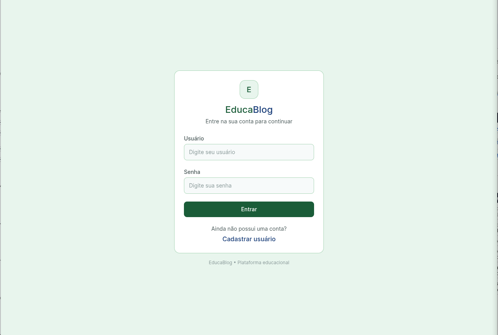
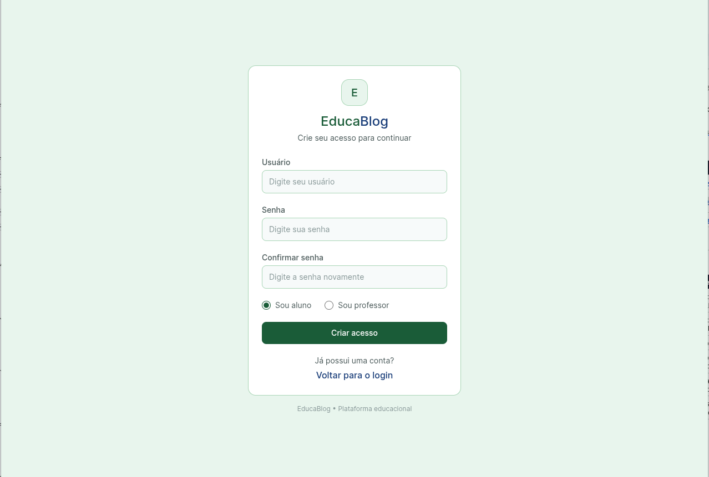
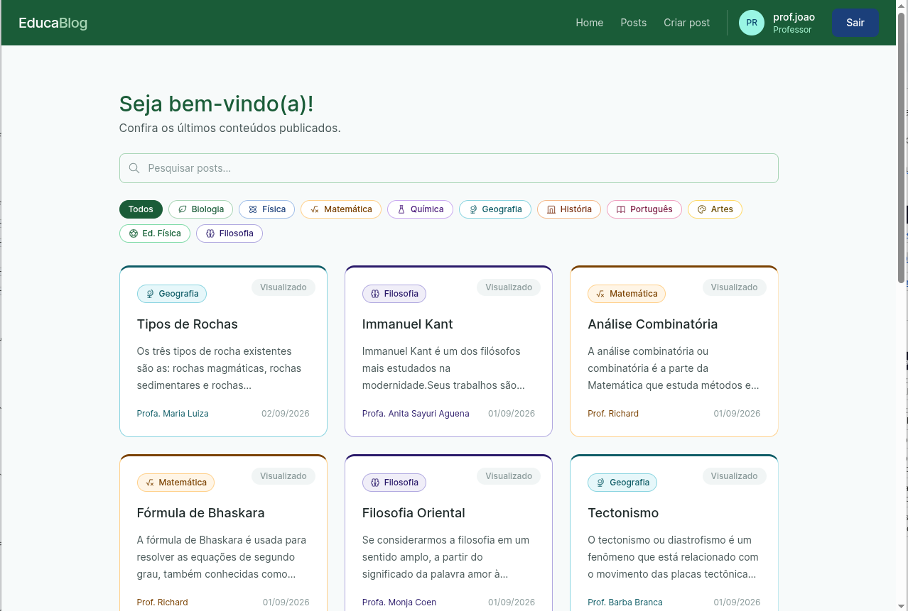
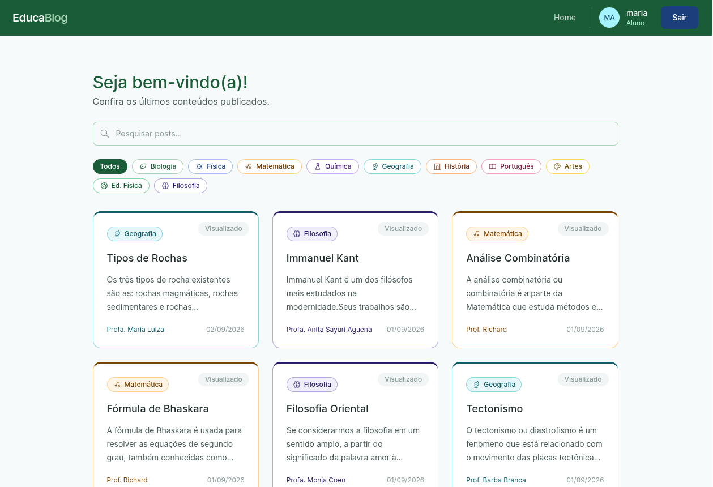
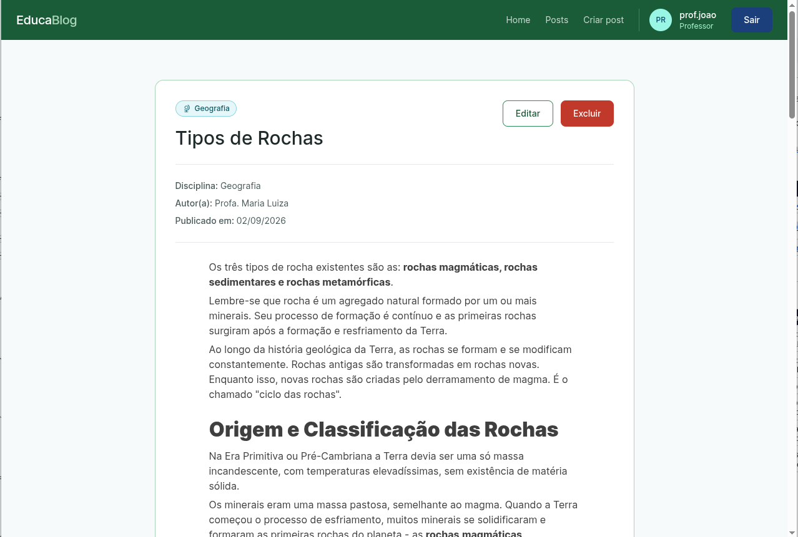
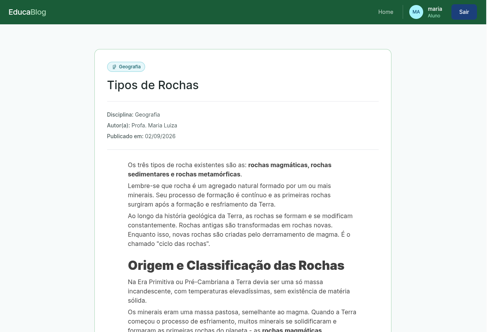
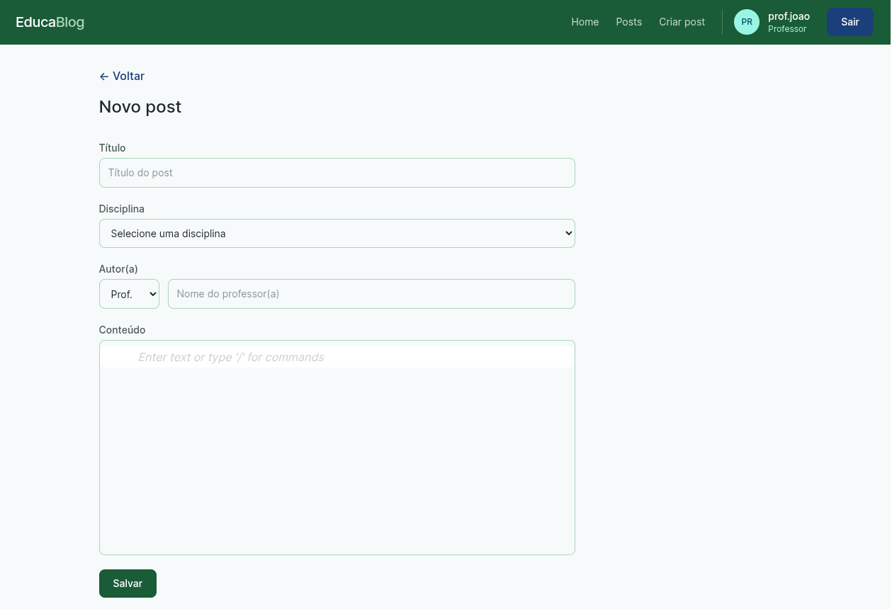
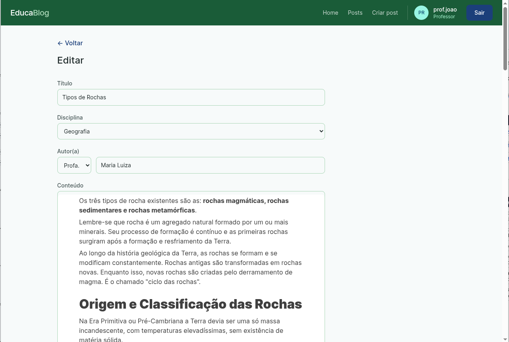
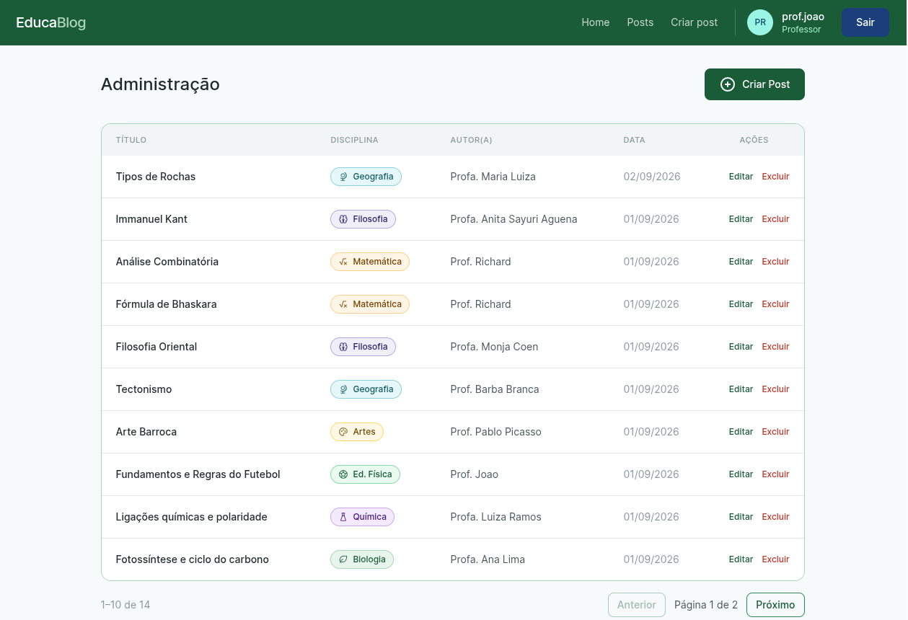

# EducaBlog — Frontend

Interface web do EducaBlog: uma plataforma de blog educacional onde professores publicam
conteúdos por disciplina e alunos leem, buscam e filtram os posts. Este repositório contém
apenas o **frontend** (SPA React). A API é um serviço separado
(`fiapfullstack/educablog-api`).

- **Stack:** React 18 + TypeScript + Vite
- **Estado:** Redux Toolkit (`@reduxjs/toolkit` + `react-redux`)
- **Rotas:** React Router v6 (`react-router-dom`)
- **HTTP:** Axios com interceptors de token
- **Estilo:** Tailwind CSS 3 + tokens CSS (design system verde/azul)
- **Editor de texto rico:** BlockNote (`@blocknote/ariakit`), conteúdo salvo como HTML
- **Ícones:** `@tabler/icons-react`

---

## Sumário

- [Setup](#setup)
- [Arquitetura](#arquitetura)
- [Telas](#telas)
- [Guia de uso](#guia-de-uso)
- [Como rodar localmente](#como-rodar-localmente)
- [Ambientes no Render](#ambientes-no-render)
- [CI/CD](#cicd)

---

## Setup

### Pré-requisitos

| Ferramenta | Versão recomendada |
|------------|--------------------|
| Node.js    | 22 LTS ou superior (CI roda em Node 22) |
| npm        | 10 ou superior |
| Docker     | opcional, para a forma containerizada |

### Passos

```bash
# 1. Clonar o repositório
git clone https://github.com/fiapfullstack2026/educablog-frontend.git
cd educablog-frontend

# 2. Instalar dependências
npm ci

# 3. Criar o arquivo de variáveis de ambiente
cp .env.example .env
```

### Variáveis de ambiente

Todas as variáveis do frontend são expostas pelo Vite e **precisam do prefixo `VITE_`**.

| Variável        | Obrigatória | Padrão                  | Descrição |
|-----------------|-------------|-------------------------|-----------|
| `VITE_API_URL`  | Sim         | `http://localhost:3000` | URL base da API EducaBlog. Usada por `src/lib/axios.ts` como `baseURL`. |

> Em build de produção o valor é "assado" no bundle no momento do `npm run build`.
> Para trocar a URL da API depois do build é necessário **rebuildar**.

### Scripts npm

| Script            | O que faz |
|-------------------|-----------|
| `npm run dev`     | Sobe o Vite dev server em `http://localhost:5173` com HMR. |
| `npm run build`   | Type-check (`tsc -b`) + build de produção do Vite em `dist/`. |
| `npm run preview` | Serve o `dist/` localmente para conferência do build. |
| `npm run lint`    | ESLint em `.ts`/`.tsx`, falha com qualquer warning (`--max-warnings 0`). |

---

## Arquitetura

### Visão geral

```
Browser (SPA React)
   │
   │  Axios (src/lib/axios.ts)
   │  - baseURL = VITE_API_URL
   │  - request interceptor: injeta "Authorization: Bearer <token>"
   │  - response interceptor: 401 fora de login → limpa sessão e redireciona /login
   ▼
API EducaBlog (serviço separado)  ──►  MongoDB
```

Em produção o `dist/` é servido por **Nginx** (imagem Docker) com fallback de SPA para
`index.html`. Não há SSR.

### Organização de pastas (feature-based)

```
src/
├── main.tsx                # bootstrap: BrowserRouter + Redux Provider + estilos globais
├── routes/
│   └── routes.tsx          # definição de todas as rotas e proteção por papel
├── store/
│   ├── index.ts            # configureStore, tipos RootState / AppDispatch
│   └── authSlice.ts        # sessão do usuário (token + user) espelhada no localStorage
├── lib/
│   └── axios.ts            # instância Axios única + interceptors de auth
├── components/             # UI compartilhada, sem regra de negócio
│   ├── Button/ Input/ Feedback/
│   ├── Layout/             # Header, Footer, Layout (casca das páginas internas)
│   └── ProtectedRoute/     # guarda de rota (autenticado / professor)
├── features/               # domínios da aplicação, cada um autocontido
│   ├── auth/
│   │   ├── components/     # LoginForm, RegisterForm
│   │   ├── hooks/          # useAuth (lê/escreve o authSlice)
│   │   ├── services/       # auth.service.ts (POST /user/signin, /user/register)
│   │   ├── utils/          # decodeToken (extrai username / isTeacher do JWT)
│   │   └── types/
│   ├── posts/
│   │   ├── components/     # PostCard, PostForm, RichTextEditor, SearchBar,
│   │   │                   #   DisciplineBadge, DisciplineFilter
│   │   ├── hooks/          # getPosts, searchPosts
│   │   ├── services/       # posts.service.ts (CRUD /posts, /posts/search)
│   │   ├── constants/      # disciplines.ts (mapa disciplina → cor + ícone)
│   │   ├── utils/          # htmlToPlainText (resumo do card a partir do HTML)
│   │   └── types/
│   └── admin/
│       ├── components/     # PostTable
│       └── hooks/          # useAdmin (lista + remove posts)
├── pages/                  # uma página por rota, compõe features + componentes
│   ├── LoginPage / RegisterPage
│   ├── HomePage            # lista pública de posts + busca + filtro por disciplina
│   ├── PostPage            # leitura de um post
│   ├── CreatePostPage / EditPostPage
│   └── AdminPage           # painel do professor
├── hooks/                  # hooks genéricos (useLocalStorage)
├── styles/                 # index.css: Tailwind + tokens CSS (:root)
└── types/                  # api.types.ts (envelopes de resposta da API)
```

**Convenções**

- Alias de import `@/` → `src/` (configurado em `vite.config.ts` e `tsconfig.json`).
- Um domínio novo = uma pasta em `features/` com `components / hooks / services / types`.
- `services/` é a única camada que fala com a API; páginas e componentes usam hooks.
- Envelopes da API padronizados em `src/types/api.types.ts`
  (`ApiResponse<T>`, `ApiListResponse<T>`).

### Autenticação e autorização

1. `POST /user/signin` retorna um **JWT**.
2. `authSlice.signIn` grava `token` e `user` no Redux **e** no `localStorage`
   (a sessão sobrevive a reload).
3. O request interceptor do Axios adiciona `Authorization: Bearer <token>` em toda chamada.
4. O response interceptor: um `401` em qualquer rota que **não** seja login/registro
   limpa o `localStorage` e força `window.location.href = "/login"`.
5. `ProtectedRoute` protege rotas no cliente:
   - `isAuthenticated` (tem token) → senão redireciona para `/login`;
   - `requireTeacher` → exige `user.isTeacher`, senão redireciona para `/`.
6. `user.isTeacher` vem do payload do JWT (`decodeToken.ts`) — controla o que aparece no
   Header e o acesso às telas de criação/edição/admin.

### Rotas

| Caminho             | Página          | Proteção            |
|---------------------|-----------------|---------------------|
| `/` e `/login`      | LoginPage       | pública             |
| `/register`         | RegisterPage    | pública             |
| `/home`             | HomePage        | pública (com Layout) |
| `/posts/:id`        | PostPage        | pública (com Layout) |
| `/posts/new`        | CreatePostPage  | professor           |
| `/posts/:id/edit`   | EditPostPage    | professor           |
| `/admin`            | AdminPage       | professor           |

### Integração com a API (endpoints consumidos)

| Método | Endpoint          | Onde |
|--------|-------------------|------|
| POST   | `/user/signin`    | `auth.service.ts` |
| POST   | `/user/register`  | `auth.service.ts` |
| GET    | `/posts`          | `posts.service.ts` |
| GET    | `/posts/:id`      | `posts.service.ts` |
| GET    | `/posts/search?q=`| `posts.service.ts` |
| POST   | `/posts`          | `posts.service.ts` |
| PUT    | `/posts/:id`      | `posts.service.ts` |
| DELETE | `/posts/:id`      | `posts.service.ts` |

### Design system

Tokens CSS em `src/styles/index.css` (`:root`), mapeados como utilitários no
`tailwind.config.js` (`green-primary`, `blue-primary`, `surface-1`, `text-primary`, …).
Fonte **Inter** (pesos 400/500). Cada disciplina tem cor de fundo, borda, cor de texto e
ícone Tabler definidos em `src/features/posts/constants/disciplines.ts`; nomes de
disciplina são normalizados (sem acento/caixa) e caem em um estilo "Geral" quando não
reconhecidos.

---

## Telas

| Tela | Arquivo | Descrição |
|------|---------|-----------|
| Login | `docs/screenshots/login.png` | Autenticação (`/login`) |
| Cadastro | `docs/screenshots/register.png` | Criação de conta (`/register`) |
| Home | `docs/screenshots/home.png` | Lista de posts + busca + filtro por disciplina (`/home`) |
| Post | `docs/screenshots/post.png` | Leitura de um post (`/posts/:id`) |
| Criar post | `docs/screenshots/create-post.png` | Formulário + editor rich text (`/posts/new`) |
| Editar post | `docs/screenshots/edit-post.png` | Formulário pré-preenchido (`/posts/:id/edit`) |
| Admin | `docs/screenshots/admin.png` | Painel do professor com exclusão de posts (`/admin`) |

### Login



### Cadastro



### Home

#### Professor



#### Aluno



### Leitura Post

#### Professor



#### Aluno



### Criar post



### Editar post



### Admin



---

## Guia de uso

### Fluxo do visitante / aluno

1. Acessar a aplicação → tela de **Login**.
2. Sem conta: **Cadastrar** (`/register`). Marcar a opção de professor só se for o caso.
3. Após login, ir para **/home**:
   - lista de posts em cards, cada um com badge da disciplina e um resumo (texto puro
     extraído do HTML do conteúdo);
   - **SearchBar** faz busca via `GET /posts/search?q=`;
   - **DisciplineFilter** filtra os cards por disciplina no cliente.
4. Clicar num card → **/posts/:id** para ler o conteúdo completo renderizado.

### Fluxo do professor

Além do acima, o Header exibe as ações de professor:

- **Novo post** (`/posts/new`): formulário com título, disciplina e o editor rich text
  (BlockNote). O conteúdo é salvo como **HTML**. Enviar → `POST /posts`.
- **Editar** (`/posts/:id/edit`): mesmo formulário pré-preenchido → `PUT /posts/:id`.
- **Admin** (`/admin`): `PostTable` lista todos os posts com ação de **excluir**
  (`DELETE /posts/:id`); a lista é atualizada localmente após a remoção.

### Sessão

- A sessão fica no `localStorage` (`token`, `user`) — fechar a aba não desloga.
- **Sair** pelo Header limpa a sessão.
- Token expirado / inválido: a primeira chamada autenticada que receber `401` desloga
  automaticamente e volta para `/login`.

---

## Como rodar localmente

Via **Docker Compose** — sobe **frontend + API + MongoDB** de uma vez.
Requer Docker e Docker Compose.

```bash
# opcional: defina a URL da API que será assada no build do frontend
export VITE_API_URL=http://localhost:3000

docker compose up --build
```

| Serviço  | Porta local | Observação |
|----------|-------------|------------|
| frontend | **8080** → 80 | Nginx servindo o `dist/` (SPA fallback) |
| api      | 3000        | imagem `fiapfullstack/educablog-api:1.0` |
| mongo    | 27017       | volume `mongo_data` persiste os dados |

Aplicação em **http://localhost:8080**.

> O `Dockerfile` é multi-stage: `node:22-alpine` para `npm ci && npm run build`, depois
> `nginx:1.27-alpine` servindo `/usr/share/nginx/html` com a config de `nginx.conf`
> (gzip, cache de assets com hash e `try_files … /index.html`).

---

## Ambientes no Render

Aplicação já publicada no Render:

| Ambiente  | URL |
|-----------|-----|
| Frontend  | https://educablog-frontend.onrender.com |
| API       | https://educablog.onrender.com — documentação (Swagger) em https://educablog.onrender.com/docs/ |

Em produção o frontend é buildado com `VITE_API_URL = https://educablog.onrender.com`.
Como é uma variável de **build**, trocar a URL da API exige um novo deploy.

### Deploy automático (Deploy Hook)

O workflow de CI dispara o deploy no Render após um push na `main` que passe no
lint + build:

```yaml
# .github/workflows/ci.yml
- name: Trigger Render deploy
  run: curl -fsS -X POST "${{ secrets.RENDER_DEPLOY_HOOK_URL }}"
```

Para habilitar: em **Render → seu serviço → Settings → Deploy Hook**, copie a URL e
cadastre em **GitHub → repo → Settings → Secrets and variables → Actions** como
`RENDER_DEPLOY_HOOK_URL`. Se preferir, desligue o "Auto-Deploy" nativo do Render para o
deploy acontecer apenas pela pipeline.

---

## CI/CD

`.github/workflows/ci.yml` roda em push e pull request para `main`:

1. **lint-and-test** — Node 22, `npm ci`, `npm run lint`, `npm run build`.
2. **deploy** — só em push na `main` e se o job anterior passar: dispara o Deploy Hook
   do Render.
